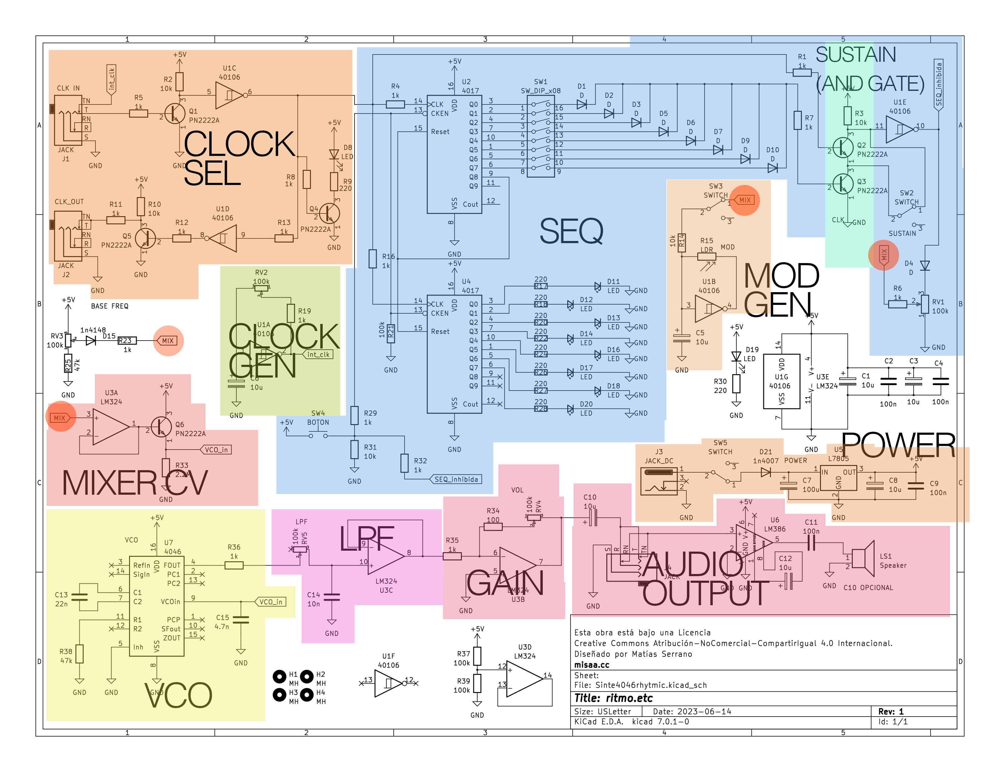

# ritmo_etc
 Simple synth based on CD4046 VCO

 [BOM/Lista de materiales](bom.pdf)  
 [Esquemático](ritmoetc_schematic_color_v1.pdf)

### Especificaciones
- Sintetizador de onda cuadrada con VCO basado en IC CD4046
- Modulación de frecuencia con LDR
- Secuenciador de activación de 8 pasos
- 2 perillas de frecuencia permiten determinar frecuencia cuando el nivel del secuenciador es bajo (low) y alto (high)
- Generación de clock propio.
- Clock out saca el clock propio. Si hay algo conectado en Clock IN, enviará ese.
- Sincronización externa por medio de pulsos de 0,7 v o más
- Filtro low-pass Simple
- Salida de línea (1v)

### Bugs de versión 1
1. Conector DC fue implementado al revés. Para corregir, cortar pin Switch (lateral) de JACK DC
2. La etapa de la compuerta SUSTAIN (AND GATE) fue mal implementada. No soldar los siguientes componentes:
  - R1
  - R32
  - Q2
  - SW2 (SUSTAIN). En su lugar, soldar los dos pines de más abajo entre ellos con un puente
3. El amplificador basado en el LM386 suena muy mal y no vale la pena utilizarlo. Mejor usar un parlante portátil externo o un mixer.

### Hackeos sugeridos

1. Busca entrar directamente al pin VCO-in del 4046 (zona mix del esquemático)
2. Si cambias el potenciómetro de gain por uno de 500k o más, aumentará más la ganancia.
3. En el clock in no solo tienen que entrar pulsos regulares. ¡Prueba con un audio o una canción!

### Esquemático vagamente explicado

